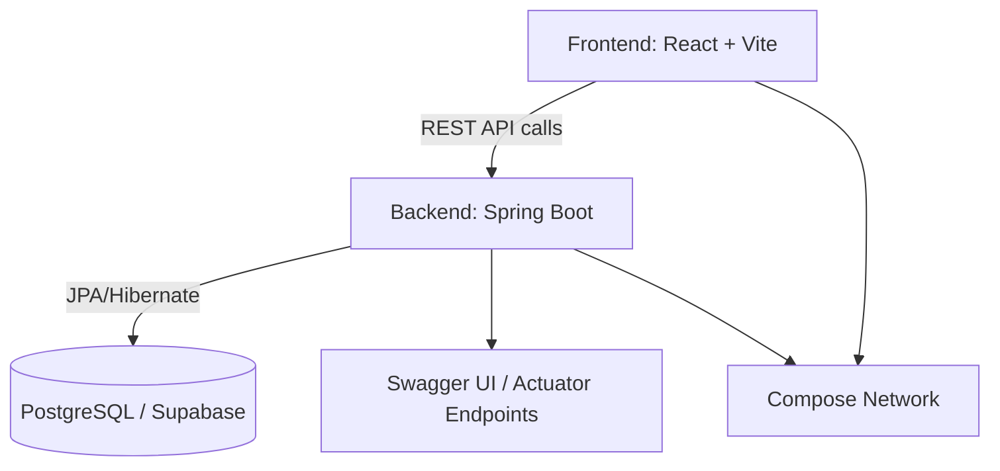

# 🧱 Spring React Vite Template

[](https://github.com/jamesmcdonald112/spring-react-vite-template/actions/workflows/test.yml)
[](./LICENSE)
[](#)

A modern **full-stack starter template** combining **Spring Boot + React + Vite +  + CI/CD**.  
Built for rapid prototyping and real-world deployment, with batteries included:  
✅ type-safe frontend, ✅ production-ready backend, ✅ local +  setup, ✅ GitHub Actions CI.

---

## 🚀 Overview

This template provides a minimal yet complete foundation for modern full-stack apps.  
It’s designed for **developer experience, testability, and maintainability**.

| Layer | Tech Stack | Highlights |
|-------|-------------|------------|
| **Frontend** | React (Vite, TypeScript, TailwindCSS, shadcn/ui) | Hooks-based, fast reload, typed API calls |
| **Backend** | Spring Boot 3 (Java 21, JPA, Actuator, OpenAPI) | RESTful, structured logging, validation |
| **Database** | PostgreSQL ( Compose or Supabase) | Works with local + hosted databases |
| **CI/CD** | GitHub Actions | Build, test, and coverage reporting |
| **Docs** | Swagger / OpenAPI | Auto-generated REST documentation |

---

## 📸 Screenshot or Demo (optional)

You can include a screenshot, animated GIF, or live demo link here.


> 💡 Tip: Store demo images in `/frontend/public` so Vite serves them easily.
> You can also embed a Loom or YouTube video if you have one, for example:
> - Demo video: https://www.loom.com/share/your-demo-id
> - Live preview: https://your-demo-url.example.com

---

## 🧭 Architecture



---

## ✨ Features

### 🖥️ Frontend
- ⚡ **Vite + TypeScript** — lightning-fast dev server with full type safety  
- 🎨 **TailwindCSS + shadcn/ui** — modern, composable UI with accessible components  
- 🧩 **React Query** — automatic caching and background data fetching  
- 🧠 **React Hook Form + Zod** — performant, schema-validated forms  
- 🔔 **Toaster + ErrorBoundary** — built-in global notifications and graceful error handling  
- 🧪 **Vitest + React Testing Library** — fast unit tests with JSDOM  

### ⚙️ Backend
- 🚀 **Spring Boot 3 + Java 21** — modern backend foundation with starter dependencies  
- 🗄️ **Spring Data JPA** — simplifies database access with minimal boilerplate  
- 📄 **Springdoc OpenAPI** — auto-generated Swagger API docs at `/swagger-ui.html`  
- 🩺 **Spring Boot Actuator** — built-in health, metrics, and readiness endpoints  
- 🧱 **Layered architecture** — Controllers → Services → Repositories → Entities → DTOs  
- 🧰 **JUnit + Mockito** — unit & integration tests ready to extend  
- 🧾 **Structured JSON logging** — production-ready logging via Logback + Logstash  

### 🐳 DevOps & Tooling
- 🧩 ** Compose** — runs backend + PostgreSQL seamlessly  
- 🧱 **Multi-stage file** — optimized build for backend JAR  
- ⚙️ **GitHub Actions CI** — build, test, coverage report per PR  
- 🔄 **Dependabot** — weekly dependency updates grouped by type  
- 🪶 **Husky + lint-staged** — auto-format and lint pre-commit  
- 🧪 **JaCoCo Coverage Report** — backend coverage shown in PR summary  
- 🧭 **EditorConfig + VSCode Extensions** — consistent formatting across environments  

---

## 🛠 Prerequisites

- Node.js 22+
- Java 21 (Temurin recommended)
-  & Docker Compose
- Git

---

## 🧩 Project Naming & Container Prefix Setup

Before running your new project for the first time, update the default names so your containers, builds, and Gradle settings are consistent.

### 1️⃣ Rename your project

Update these files:
- settings.gradle →
rootProject.name = "readability-analyser"
- frontend/package.json →
"name": "readability-analyser"
- README.md →
Update the title and any project references.
- GitHub repository →
Rename it to match (e.g. readability-analyser).
- .env → update COMPOSE_PROJECT_NAME=your-project-name
This defines your Docker container prefixes.


### 2️⃣ Set your Docker Compose project name

In your .env file, define a unique prefix for your container names:
```bash
COMPOSE_PROJECT_NAME=your-project-name
```
This ensures containers are isolated, e.g.:
	•	readability-analyser-backend
	•	readability-analyser-db

To rename for a different project later, just update the variable:
```bash
COMPOSE_PROJECT_NAME=my-next-app
docker compose down -v
docker compose up --build
```

### 3️⃣ Verify your setup

Run:
```bash
docker ps
```

You should see containers like:
```bash
readability-analyser-backend
readability-analyser-db
```

If not, ensure your .env is correctly loaded and you’ve rebuilt with:
```bash
docker compose down -v
docker compose up --build
```

---

## ⚙️ Environment Setup

Before running anything, create `.env` files.

**Option 1 — Automatic setup**

```bash
sh setup.sh
```

**Option 2 — Manual setup**

```bash
cp .env.example .env
cp frontend/.env.example frontend/.env
```

> The root `.env` controls backend profiles.  
> Set `SPRING_PROFILES_ACTIVE=dev | supabase | prod`.

---

## 🧱 Backend (Spring Boot)

```bash
cd backend
./gradlew bootRun
```

Access your backend at:

- **API Base URL:** [http://localhost:8080](http://localhost:8080)  
- **Swagger Docs:** [http://localhost:8080/swagger-ui.html](http://localhost:8080/swagger-ui.html)  
- **Health Check:** [http://localhost:8080/actuator/health](http://localhost:8080/actuator/health)

To verify health via terminal:

```bash
curl http://localhost:8080/actuator/health
```

> 💡 **Tip:** Without these `.env` files in place, frontend requests like `/api/ping` may fail or return HTML instead of JSON responses.  
> Always ensure both `backend/.env` and `frontend/.env` exist before running the servers.

> 💡 Note: The root .env file is used only for local development and Docker Compose. When deploying to Render, ignore the .env file and instead add your variables in Render → Environment → Add Environment Variable. Render automatically injects them into the container. This keeps your secrets secure and prevents credentials from being committed to Git.

---

## 🌍 Backend Profiles

| Profile | Description | Database | Command |
|----------|--------------|-----------|----------|
| `dev` | Local file-based H2 | H2 | `./gradlew bootRun` |
| `supabase` | Hosted Supabase PostgreSQL | Supabase | `docker compose up --build backend` |
| `prod` | Dockerized PostgreSQL | Local Docker container | `docker compose up --build` |

**Health check:**

```bash
curl http://localhost:8080/actuator/health
```

---

## 💻 Frontend (React + Vite)

```bash
cd frontend
npm install
npm run dev
```

App → http://localhost:5173  

---

## 🪪 Frontend Title & Metadata (Browser Tab Setup)

If your browser tab still shows the old project name (like “Pomodoro”), update the following:

### 1️⃣ index.html (in frontend/)

Open frontend/index.html and update the <title> and meta tags:

```html
<!doctype html>
<html lang="en">
  <head>
    <meta charset="UTF-8" />
    <link rel="icon" type="image/svg+xml" href="/vite.svg" />
    <meta name="viewport" content="width=device-width, initial-scale=1.0" />
    <meta name="description" content="Readability Analyser App" />
    <title>Readability Analyser</title>
  </head>
  <body>
    <div id="root"></div>
    <script type="module" src="/src/main.tsx"></script>
  </body>
</html>
```

This sets the tab title and description when the app loads.

### 2️⃣ Dynamic Title (Optional)

If you want React to control the page title dynamically (for routes or pages), use:
```javascript
import { useEffect } from "react";

function Dashboard() {
  useEffect(() => {
    document.title = "Dashboard | Readability Analyser";
  }, []);
  
  return <h1>Welcome to your Dashboard</h1>;
}
```
You can later automate this for all pages using React Helmet or a custom <PageTitle /> component.

### 3️⃣ Optional: Vite Config Branding

In vite.config.ts, you can also change the app name for dev server messages or PWA configs:
```ts
export default defineConfig({
  plugins: [react()],
  define: {
    __APP_NAME__: JSON.stringify("Readability Analyser"),
  },
});
```

This is purely cosmetic but helps maintain consistency if you print your app name anywhere in logs or metadata.

---

## 🐳 Docker

**Full Stack (backend + PostgreSQL):**

```bash
 compose up --build
```

**Backend Only (for Supabase mode):**

```bash
 compose up --build backend
```

If you get a port error (`Bind for 0.0.0.0:8080 failed`):

```bash
 ps
 stop <container_id>
 compose down -v
```

---

## 🐳 Docker Tips & Troubleshooting

### 🧩 Backend-Only Mode (for Supabase)
If you’re using Supabase as your database and don’t want to run the local Docker PostgreSQL container, you can start only the backend service:

```bash
docker compose up --build backend
```

This will skip the internal db service and connect directly to your Supabase instance, provided your .env is configured with the correct SUPABASE_* values.

### ⚠️ Common Port Conflict (8080 already in use)

If you see this error:
```bash
Bind for 0.0.0.0:8080 failed
```

It means another container or process is already using port 8080.
Run the following to identify and stop the conflicting container:

```bash
docker ps
docker stop <container_id>
docker compose down -v
```

After that, re-run:

```bash
docker compose up --build
```

### 🧹 Full Reset

If you want a completely clean build (rebuilding all images and removing old volumes):

```bash
docker compose down -v
docker system prune -af
docker compose up --build
```
---

## 🧩 Project Name and Docker Container Prefix

Docker Compose uses the COMPOSE_PROJECT_NAME variable to name containers and volumes.
This keeps environments isolated and prevents conflicts between different projects using the same service names.

Set your project name in .env like this:

```bash
COMPOSE_PROJECT_NAME=readability-analyser
```

If you rename your project later, update this value to match:
```bash
COMPOSE_PROJECT_NAME=my-new-app
```

Then rebuild your stack to apply the new names:

```bash
docker compose down -v
docker compose up --build
```

> 💡 Tip: Run docker ps to verify the new container names,
e.g. my-new-app-backend and my-new-app-db.

---

## 🧹 Docker Cleanup & Rebuild Commands (for Troubleshooting)

If you encounter container name conflicts, port issues, or database mismatches between projects, use these cleanup commands.

Remove existing containers (if names conflict):

```bash
docker rm -f spring-backend
docker rm -f postgres-db
```

Optional full cleanup (recommended after template updates):

```bash
docker compose down -v
docker system prune -af
```

Rebuild backend and database:

```bash
docker compose up --build backend
```

> 💡 Tip: These commands are safe to run — they only remove stopped containers and unused images. Useful whenever you switch between multiple full-stack projects or refresh your Docker setup.

---

## ⚠️ Docker Container Name Conflicts (Troubleshooting)

Sometimes you’ll see an error like this when rebuilding:

```
Error response from daemon: Conflict. The container name "/postgres-db" is already in use.
You have to remove (or rename) that container to be able to reuse that name.
```

This happens when:
	•	You’ve run another project using the same container names (spring-backend, postgres-db)
	•	Docker didn’t fully remove the old containers or volumes

✅ Fix the conflict

Remove the old containers:
```bash
docker rm -f spring-backend
docker rm -f postgres-db
```

Then rebuild cleanly:
```bash
docker compose up --build
```

### 🧩 Prevent conflicts with COMPOSE_PROJECT_NAME

By default, Docker Compose names containers based on the COMPOSE_PROJECT_NAME variable in your .env file.
Always set this to your current project name before running docker compose up:

```bash
COMPOSE_PROJECT_NAME=your-project-name
```

If you clone this template for another app, change the name to avoid reusing the same containers:
```bash
COMPOSE_PROJECT_NAME=my-next-app
docker compose down -v
docker compose up --build
```

> 💡 Tip: This keeps projects fully isolated — no overlapping containers or ports, even when running multiple stacks

---

## ⚙️ Environment Variables

### Root `.env.example`

```bash
# =========================================================
# 🌱 ACTIVE SPRING PROFILE
# =========================================================
# Choose which environment to run:
#   dev       → Local H2 (default)
#   supabase  → Hosted PostgreSQL (Supabase)
#   prod      → Dockerized PostgreSQL
SPRING_PROFILES_ACTIVE=dev


# =========================================================
# 🧱 LOCAL DEV (H2)
# =========================================================
# Uses a file-based H2 database: ./data/devdb
# No credentials required.
# For local H2 development, leave all Supabase variables empty ("").


# =========================================================
# 🟢 SUPABASE (Cloud DB)
# =========================================================
# For Supabase testing, fill in your credentials manually in .env.
# Build your JDBC URL like:
#   jdbc:postgresql://<REGION>-<REF>.pooler.supabase.com:6543/<DATABASE>?sslmode=require
#
# Found in: Supabase Dashboard → Settings → Database → Connection Info → Transaction Pooler (IPv4)
#
# Example:
# SUPABASE_JDBC_URL=jdbc:postgresql://aws-1-eu-west-1.pooler.supabase.com:6543/postgres?sslmode=require
# SUPABASE_USERNAME=your_supabase_username
# SUPABASE_PASSWORD=your_supabase_password
#
# ✅ Best practice:
# - Leave these blank ("") for local development (H2)
# - Fill them in only for Supabase testing
# - For production (Render), set them ONLY in the Render Environment tab

SUPABASE_JDBC_URL=""
SUPABASE_USERNAME=""
SUPABASE_PASSWORD=""


# =========================================================
# 🐳 PROD (Docker PostgreSQL)
# =========================================================
# Used when running `docker compose up` with SPRING_PROFILES_ACTIVE=prod

POSTGRES_USER=admin
POSTGRES_PASSWORD=password
POSTGRES_DB=appdb


# =========================================================
# 🧩 PROJECT IDENTIFIER
# =========================================================
# Used by Docker Compose to name your containers.
# Update this value per project (e.g. readability-analyser, calendar-app, etc.)

COMPOSE_PROJECT_NAME=your-project-name
```

---

⚙️ Environment Variable Notes (COMPOSE_PROJECT_NAME and Supabase Warnings)

Docker Compose automatically loads variables from your .env file at the project root.
This includes keys like COMPOSE_PROJECT_NAME, SPRING_PROFILES_ACTIVE, and any SUPABASE_* credentials.

If these are missing, you might see warnings like:

```
WARN[0000] The "SUPABASE_PASSWORD" variable is not set. Defaulting to a blank string.
```

These warnings are harmless — they simply mean you haven’t filled in your Supabase credentials.
However, to silence them, add empty placeholders in your .env:

```bash
SUPABASE_JDBC_URL=""
SUPABASE_USERNAME=""
SUPABASE_PASSWORD=""
```

> 💡 Tip: The COMPOSE_PROJECT_NAME variable also comes from your .env. You can change it anytime to isolate containers for a new project:

```bash 
COMPOSE_PROJECT_NAME=my-other-project
docker compose up --build
```

---

## 🧪 Quick Integration Test (API ↔ Frontend Connection)

Once your backend and frontend are both running, you can verify they communicate correctly.

### 1️⃣ Test the backend API directly

Run this in your terminal:
```bash
curl http://localhost:8080/api/ping
```

Expected response:
```json
{"message": "pong"}
```

If you see "pong", your backend is running correctly 🎯

### 2️⃣ Test from the browser console

In your browser’s DevTools Console (e.g., Chrome → right-click → Inspect → Console tab):
```javascript
fetch('http://localhost:8080/api/ping')
  .then(res => res.json())
  .then(console.log)
```

Expected log:
```json
{ message: "pong" }
```

If you get a SyntaxError: Unexpected token 'p' —
it means your ping endpoint returns a plain string like "pong" instead of JSON.
To fix this, your controller should look like:

```java
@GetMapping("/ping")
public Map<String, String> ping() {
    return Map.of("message", "pong");
}
```

> 💡 Tip: Once this test passes, your backend and frontend integration is confirmed. You can safely proceed with adding your first real API routes and frontend components.

---

## ⚙️ Environment Variables

Each service has its own `.env.example` for reference.  
The backend `.env` controls which database and profile are active.

---

### 🟢 Supabase Connection Guide

If you’re using Supabase instead of local Postgres, you’ll need to configure three values in your `.env`:

```bash
SUPABASE_JDBC_URL=jdbc:postgresql://<REGION>-<REF>.pooler.supabase.com:6543/<DATABASE>?sslmode=require
SUPABASE_USERNAME=your_supabase_username
SUPABASE_PASSWORD=your_supabase_password
```

### 🔍 Where to find these

In your Supabase Dashboard:
	1.	Dashboard Navbar → Connection Info
	2.	Copy the Transaction Pooler (IPv4) URL
	•	Example: 
    `aws-1-eu-west-1.pooler.supabase.coma`
  3. Build your JDBC URL like this: 
    `jdbc:postgresql://aws-1-eu-west-1.pooler.supabase.com:6543/postgres?sslmode=require`
  4.	Use your Supabase credentials for SUPABASE_USERNAME and SUPABASE_PASSWORD.

> 💡 Always use the ?sslmode=require flag to ensure a secure connection.

### ⚙️ Optional Cleanup

If you’re not using Supabase and want to avoid Docker warnings like:

`The 'SUPABASE_JDBC_URL' variable is not set. Defaulting to a blank string.`

You can safely add these empty lines to your .env:

```
SUPABASE_JDBC_URL=""
SUPABASE_USERNAME=""
SUPABASE_PASSWORD=""
```

  
### Frontend `frontend/.env.example`

```bash
VITE_API_URL=http://localhost:8080/api
```

---

## 🧪 Testing

### Frontend

```bash
cd frontend
npm test
```

### Backend

```bash
cd backend
./gradlew test
./gradlew jacocoTestReport
```

Coverage Report →  
`backend/build/reports/jacoco/test/html/index.html`

---

## 🧰 Continuous Integration (CI)

GitHub Actions run automatically on push and pull requests:

- 🧪 Run frontend & backend tests  
- 📊 Upload coverage  
- ✅ Show coverage summary in PRs  
- 🔁 Dependabot weekly updates  
- 🪶 Lint & format with Husky + lint-staged  

---

## 🧱 Project Structure

```bash
spring-react-vite-template/
├── backend/
│   ├── src/main/java/...
│   ├── src/test/java/...
│   ├── build.gradle
│   └── file.backend
├── frontend/
│   ├── src/
│   ├── vite.config.ts
│   └── package.json
├── .github/workflows/
├── -compose.yml
├── .env.example
├── .editorconfig
├── .vscode/extensions.json
└── README.md
```

---

## ✅ Template Checklist

Before reusing this template for a new project, follow these steps carefully to ensure everything builds and deploys correctly.
	1.	Rename your project
Update all project names to match your new app:
	- settings.gradle →
    ```groovy
    rootProject.name = "your-project-name"
    ```
  - frontend/package.json →
    ```json
    "name": "your-project-name"
    ```
  - README.md → Update the title, examples, and any references to spring-react-vite-template
  - GitHub repository → Rename it to match (e.g. readability-analyser)

2.Set your Docker project prefix
  In your root .env file, add or update this line:
  ```bash
  COMPOSE_PROJECT_NAME=your-project-name
  ```
  This ensures your containers are uniquely named (e.g. your-project-name-backend).
  Rebuild to apply:
  ```bash
docker compose down -v
docker compose up --build
```

3.	Select your active Spring profile
In .env, choose which database environment you want:
```bash
SPRING_PROFILES_ACTIVE=dev        # Local H2 (default)
SPRING_PROFILES_ACTIVE=supabase   # Hosted Supabase PostgreSQL
SPRING_PROFILES_ACTIVE=prod       # Dockerized PostgreSQL
```

4.	For Supabase users
Fill in your database credentials:
```bash
SUPABASE_JDBC_URL=jdbc:postgresql://<REGION>-<REF>.pooler.supabase.com:6543/<DATABASE>?sslmode=require
SUPABASE_USERNAME=your_supabase_username
SUPABASE_PASSWORD=your_supabase_password
```

Then run only the backend:
```bash
docker compose up --build backend
```

5.	For Docker/PostgreSQL users
Use or adjust the default database values in .env:
```bash
POSTGRES_USER=admin
POSTGRES_PASSWORD=password
POSTGRES_DB=appdb
```

Run the full stack:
```bash
docker compose up --build
```

6.	For local dev (H2 mode)
No Docker needed — just run:
```
./gradlew bootRun
```

7.	Verify backend health
```bash
curl http://localhost:8080/actuator/health
```

8.	Update frontend API URL
In frontend/.env, make sure:
```bash
VITE_API_URL=http://localhost:8080/api
```

9.	Customise your project
  - Replace example entities, controllers, and UI components
  - Adjust branding, endpoints, and Docker names
  - Update any references in .env.example

> 💡 Tip:
If you ever get container name conflicts, re-run:
```bash
docker rm -f spring-backend postgres-db
docker compose down -v
docker system prune -af
docker compose up --build
```


---

## 📜 License

Licensed under the **MIT License** — see [LICENSE](./LICENSE).

---

**Built with ❤️ using React, Spring Boot, , and GitHub Actions.**
